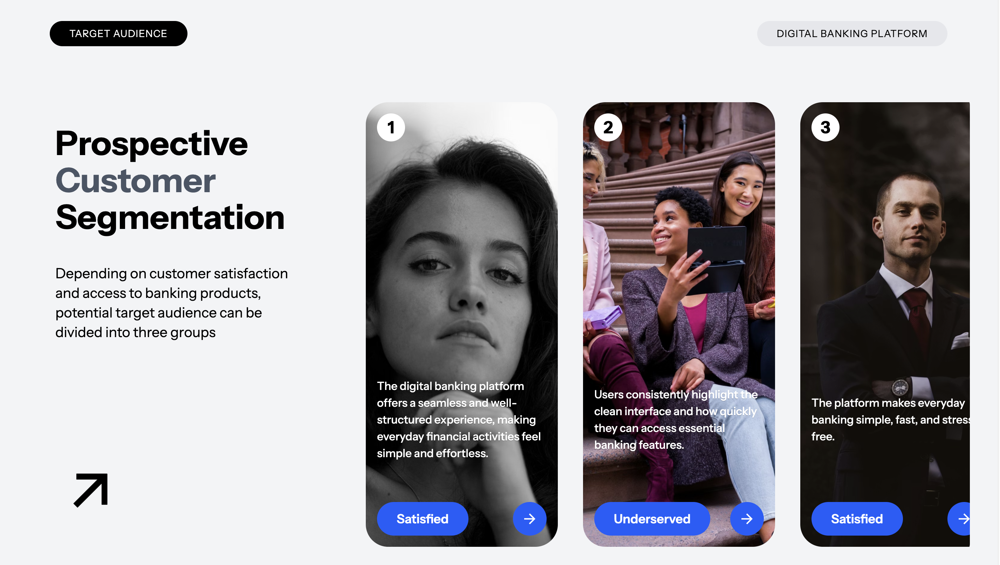

# 🏦 Digital Banking UI – React Project

A modern **Digital Banking Platform UI** built using **React**, focused on clean layout, strong typography, and visual storytelling.  
This project demonstrates **prospective customer segmentation** through a card-based design system.

---

## ✨ Features

- 📊 **Prospective Customer Segmentation**
- 🎨 Clean, modern banking UI
- 🧩 Reusable React components
- 📱 Responsive layout
- 🖼️ Image-based cards with overlay text
- ⚡ Built using Vite for fast development

---

## 🛠️ Tech Stack

- ⚛️ **React**
- ⚡ **Vite**
- 🎨 **CSS / Tailwind CSS**
- 🧠 **JavaScript (ES6+)**

---

## 📸 Preview




---

## 📂 Project Structure

```bash
src/
│── components/
│   ├── Card.jsx
│   ├── Section.jsx
│
│── App.jsx
│── main.jsx
│── index.css
